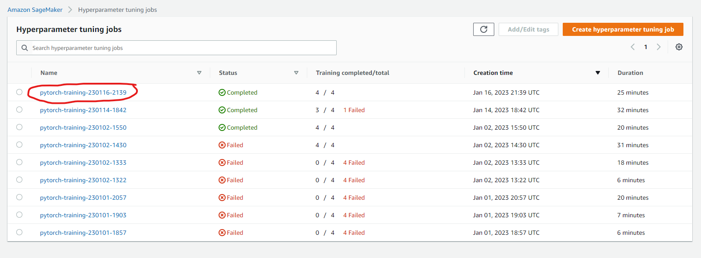
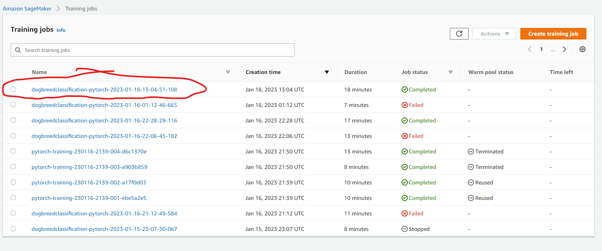
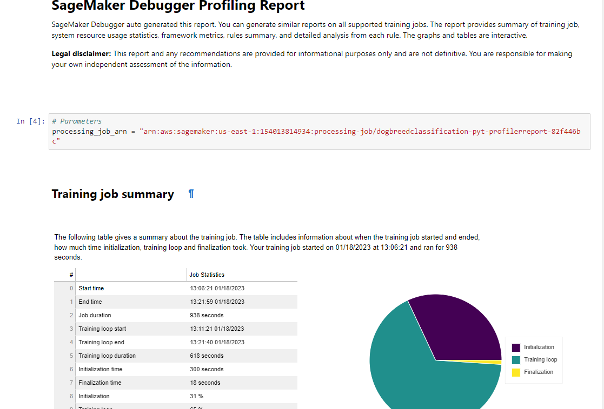
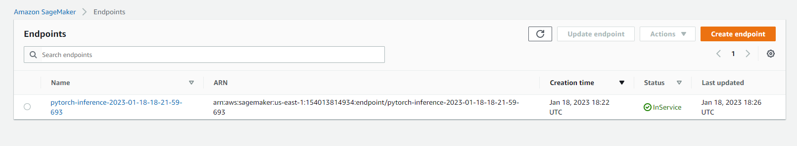

# Image Classification using AWS SageMaker

Use AWS Sagemaker to train a pretrained model that can perform image classification by using the Sagemaker profiling, debugger, hyperparameter tuning and other good ML engineering practices. 

In this project I will train a Resnet50 neural network to identify dog breeds based on the udacity-provided dogbreed image dataset.

## Project Set Up and Installation
Enter AWS through the gateway in the course and open SageMaker Studio. 
Run through the appropriately named sections in "train_and_deploy.ipynb" to get the desired output. 

## Dataset
I'm using the dataset supplied to this udacity project which is the dog breed classification dataset. This dataset is comprised of 133 breeds or classes. Some examples of those classes are Affenpinschers, Akitas, Basset hounds,and Poodles. There are approximately 8300 training images,8300 test images, and 8300 validation images.

### Access
For this project the data needs to be uploaded to a bucket called "dogbreedclassificationudacity". The steps for uploading are in the notebook "train_and_deploy.ipynb"

### AWS Image Settings for Notebook train_and_deploy.ipynb.
Pytorch Framework = 1.8  
Python Version = 3.6 
## Hyperparameter Tuning
What kind of model did you choose for this experiment and why? Give an overview of the types of parameters and their ranges used for the hyperparameter search
I chose a ResNet50 model for model training for 2 reasons: I was comfortable using it as a pre-trained model for this project and I thought that 50 layers was enough to do some real learning but not too many that the training process would take too long.
Remember that your README should:
### Hyper Parameter Optimization Jobs

I chose to tune lr (learning rate), batch_size, and epochs, because they seemed to me like they would have the largest impact on training speed and accuracy. I kept the epochs range rather small in order to avoid large cost accumulation during the course of this project. The best hyperparameters retrieved were the following:   

'batch_size': '"256"', 
 'epochs': '"4"', 
 'lr': '0.0037606895378491374'. 
### Model Training Jobs

Above is a screenshot of my model training jobs with the final one that was deployed circled in red.

## Debugging and Profiling
I performed model debugging and profiling in Sagemaker by using the "smdebug" package. Through this package we can monitor the performance of the training, called debugging, as well as how effectively we utilize the resources of the instance, called profiling. We implement these tools by putting smdebug "hooks" into our functions contained in train_model.py. These hooks then report back to the overall smdebug debugging and profiling process. You can tell the debugger what are the important metrics to follow while training, called rules. The rules I used were the following:

rules = [
    Rule.sagemaker(rule_configs.vanishing_gradient()),
    Rule.sagemaker(rule_configs.overfit()),
    Rule.sagemaker(rule_configs.overtraining()),
    Rule.sagemaker(rule_configs.poor_weight_initialization()),
    Rule.sagemaker(rule_configs.loss_not_decreasing()),
    ProfilerRule.sagemaker(rule_configs.LowGPUUtilization()),
    ProfilerRule.sagemaker(rule_configs.ProfilerReport())
]

A snapshot of the profiling report is included here because I'm having trouble displaying the plots in the html. The snapshot here is proof that the images displayed in my notebook.

### Results

It seems like there is anomalous behavior in my debugging output. Some examples are below.

I have an overfitting error. Overfitting can be fixed in a few ways. I can decrease the size of my network down from a resnet50 to a resnet 18, for example. I can also augment the data that I'm using for the project.
I have low GPU utilization. I could avoid this in the future by either increasing batch size or using a smaller instance.

I also learned that most of my training time is not spent in my training and validation steps of my modeling cycle. Ideally most of the training time should be spent there. That means I should optimize the data loading and outputting portions of my code.

The profiling report, "profiler-report.html" is provided but for some reason the I can't get the images to render in the html. The notebook is included as well. I think the rendering issue has something to do with my sagemaker studio configuration. I attempted to capture that report in the train_and_deploy_fila_tg.html, but it didn't show there as well

## Model Deployment

The endpoint exposes the last training job I ran on my resnet50 model. In order to deploy the model I found that I had to generate a custom inference.py script which is included with this submission. The endpoint accepts byte-encoded images passed through json. An example of how to input data can be seen below.

-------------------------
import base64

tmp_name = 'dogImages/valid/007.American_foxhound/American_foxhound_00526.jpg'  
data = {} 
with open(tmp_name, "rb") as image_file: 
$\;\;\;\;\;$ image = base64.b64encode(image_file.read()) 
    
data['inputs'] = base64.encodebytes(image).decode('ascii') 

---------------------------

You'll need to invoke the endpoint give the endpoint "data".

